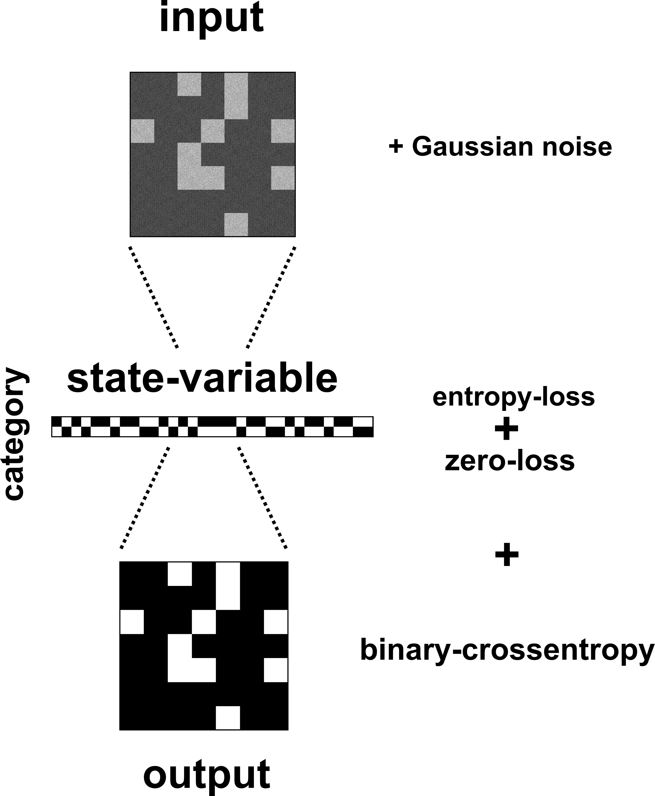

# Planning Peg-Solitaire based on images
Using a Gumbel-Softmax Categorical-Autoencoder a 33-bit state encoding has been learned.\
The figure below shows the Autoencoder network-structure,\
by additionally minimising the entropy in the bottleneck a binary encoding can be learned.

  

Analysing the found encoding shows that every Peg has been mapped to one bit:

  

Following, these state encodings where used to learn a 8-bit action encoding.\
The figure below shows the network-structure, the before-state s gets concatenated to every layer in the Autoencoder.\
This allows to learn a decoder which can output the after-state from a given before-state and an encoded action.

  

One exemplary action encoding:

  

Finally, using PU-learning, a state and transition classifier was trained.\
These networks decide if a state or transition is legal or illegal.

Corresponding Papers:\
[Classical Planning in Deep Latent Space: Bridging the Subsymbolic-Symbolic Boundary](https://arxiv.org/abs/1705.00154)\
[Towards Stable Symbol Grounding with Zero-Suppressed State AutoEncoder](https://arxiv.org/abs/1903.11277)

## Executing the code
All the above networks can be trained and their performance can be controlled in the *<a href="analyse.ipynb">analyse.ipynb</a>* jupyter-notebook.

A random Peg-Solitaire game can be simulated executing the *<a href="simulate.ipynb">simulate.ipynb</a>* notebook.\
Following parameters can be set:
- *randomSteps*: defines the number of moves executed
- *randomPath*: with this optional parameter the action number to be executed can be defined (this action has to be legal)
- *showAll*: setting this parameter to *True* shows all possible successor at each step

Three random steps:

  

  

  

The given game simulation code can be easily modified to run a depth/breadth first search on the transition tree.